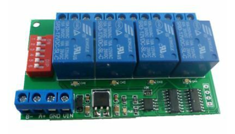

# Mosbus Relay


## คุณสมบัติ
- ใช้กับแหล่งจ่ายไฟ 12VDC
- สื่อสารด้วย RS485 Half Duplex กําหนด Slave Device ID ได้อิสระจากคําสั่ง
- 4 Output Relay 2 Contact (NO / COMMON / NC)
    - AC Contact Rating 10A / 220VAC
    - DC Contact Rating 10A / 30VDC
- 4 Input Opto-Isolate 12V แบบ Sink Input
- การเชื่อมต่อสื่อสารผ่านสัญญาณแบบ RS485 Half Duplex ด้วย Modbus RTU Protocol
    - สามารถกําหนดค่า Slave Address ได้อิสระจาก คําสั่ง
    - Baudrate 9600bps, Data 8Bit, None Parity, 1 Stop Bit
- มีคําสั่งรองรับการทํางานแบบ
    - Write Single Coil (0x05) สําหรับสั่ง ON/OFF
    - Read Discrete Inputs(0x02) สําหรับสั่งอ่านสถานะ Input

## การใช้งาน
ในการทดลองนี้ใช้ npm package modbus-serial ซึ่งจะใช้ method writeCoil ดังรูป
    


โดยที่ 
- address ในการทดลองนี้ มีค่าตั้งแต่ 0-3 โดยที่ 0 คือ channel 1 ตามลำดับ
- state มีค่าเป็น true, false โดยที่ true คือการสั่งให้รีเลย์ทำงาน (ขา C ต่อกับขา NO )
และ false คือ การสั่งให้รีเลย์ไม่ทำงาน (ขา C ต่อกับ ขา NC)

## การสั่งงานผ่านหน้าเว็บ
ในที่นี้ผู้ทดลองได้ทำการสร้างปุ่มกดขึ้นมาโดยได้ทำการ bind กับ angular function ในการสั่งเปิด/ปิดรรีเลย์
- หากสั่งเปิดรีเลย์ จะทำการส่ง request ไปยัง /modbus/on/:ch
- หากสั่งปิดรีเลย์ จะทำการส่ง request ไปยัง /modbus/off/:ch
แสดงได้ดังต่อไปนี้

### Template HTML (jade renderer)
```jade
doctype html
html(lang="en")
    head
        meta(charset='utf-8')
        meta(name='viewport', content='width=device-width, initial-scale=1.0')
    body(ng-app='app')
        h1 Relay Controller
        div(ng-controller='modbusCtrl')
            button(ng-click='turnOnRelay(0)') ON RELAY CH.1
            button(ng-click='turnOnRelay(1)') ON RELAY CH.2
            button(ng-click='turnOnRealy(2)') ON RELAY CH.3
            button(ng-click='turnOnRealy(3)') ON RELAY CH.4 
            button(ng-click='turnOffRelay(0)') OFF RELAY CH.1
            button(ng-click='turnOffRelay(1)') OFF RELAY CH.2
            button(ng-click='turnOffRealy(2)') OFF RELAY CH.3
            button(ng-click='turnOffRealy(3)') OFF RELAY CH.4
        script(type='text/javascript', src='/lib/angular/angular.min.js')
        script(src="/modbusRTU.js")
```
### Angular (modbusRTU.js)
angular app และ controller ที่ใช้กับ HTML ด้านบน แสดงได้ดังต่อไปนี้
```js
angular.module('app',[])
.controller('modbusCtrl',['$scope','$http',function($scope,$http){
    $scope.turnOnRelay=function(ch){
        $http.get('http://raspberrypi.local:3009/modbus/on/'+ch)
        .then((response)=>{
            console.log(response);
        }).catch((err)=>{
            console.log(err);
        })
    }

    $scope.turnOffRelay=function(ch){
        $http.get('http://raspberrypi.local:3009/modbus/off/'+ch)
        .then((response)=>{
            console.log(response);
        }).catch((err)=>{
            console.log(err);
        })
    }
}])


```

## Request Handler
```js
    var express=require('express');
    var app=express();
    var modbusSerial=require('modbus-serial');
    var modbusRTU=new modbusSerial();
    modbusRTU.connectRTU("/dev/ttyUSB0",{buadRate:9600});
    
    app.get('/modbus/on/:ch',(req,res)=>{
        modbusRTU.writeCoil(req.params['ch'],1).then((data)=>{
            res.send(data);
        }).catch((err)=>{
            res.send("ERROR");
        });
    });

    app.get('/modbus/off/:ch',(req,res)=>{
        modbusRTU.writeCoil(req.params['ch'],0).then((data)=>{
            res.send(data);
        }).catch((err)=>{
            res.send("ERROR");
        });
    });

    app.listen(3009);
```
